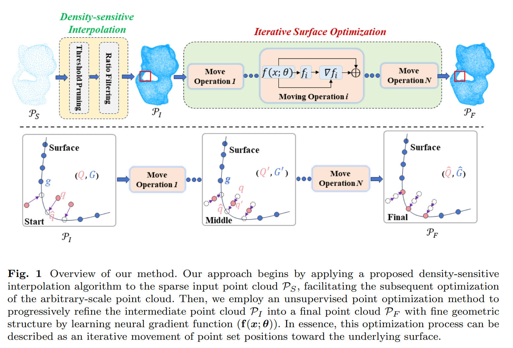

# The Official code of our paper "Unsupervised Arbitrary-Scale Point Cloud Upsampling by Learning Neural Gradient Function".

## About Paper

Our paper has been successfully accepted by MultiMedia Systems(MS). [Paper LinK](https://link.springer.com/article/10.1007/s00530-025-01870-x)



## Abstract

Point cloud upsampling aims to generate a dense and uniform point cloud from a sparse input, supporting various downstream tasks such as surface reconstruction and semantic segmentation. Current point cloud upsampling approaches mainly rely on ground truth complete point clouds as supervision, which are rarely available in real-world situations. Moreover, they are subject to fixed upsampling scale, thus are inconvenient to produce dense point clouds with desired resolution. To address these issues, we propose an arbitrary-scale point cloud upsampling method without supervision. Firstly, we employ a densitysensitive interpolation strategy designed to restore the sparse input point cloud into a dense point cloud of arbitrary scale. Then we derive the neural gradient function from the input point cloud to optimize the locations of surface points, thereby reducing noise and outliers. Experimental results demonstrate that our method not only achieves better visual results with fewer parameters but also exhibits competitive performance on the PU-GAN and PU1K datasets.

## Data

1. [PU-GAN](https://drive.google.com/file/d/1BNqjidBVWP0_MUdMTeGy1wZiR6fqyGmC/view)
2. [PU1K](https://drive.google.com/drive/folders/1k1AR_oklkupP8Ssw6gOrIve0CmXJaSH3)

## Performance


## Train

To train the model, follow these steps:

```python
python train_gt.py --mode=train --gpu=0 --data_set={data_Set} --up_rate={number}
```

## Test

To test the model, follow these steps:

```python
python train_gt.py --mode=test --gpu=0 --data_set={data_Set} --ckpt_dir={ckpt_dir} --ckpt_iter={10000/20000} --save_normal_xyz={True/Fasle}
```

## Evaluation

Our evaluation method adopts the method provided by [Grad-PU](https://github.com/yunhe20/Grad-PU).

## Acknowledgments

Our method is grateful for the support of [Grad-PU](https://github.com/yunhe20/Grad-PU) and [NeuralGF](https://github.com/LeoQLi/NeuralGF). Thanks for their great work.

## Citation

We appreciate your attention to our work! If you find our project is useful, please consider citing us:

```python
@article{gao2025unsupervised,
  title={Unsupervised arbitrary-scale point cloud upsampling by learning neural gradient function: T. Gao et al.},
  author={Gao, Tao and Feng, Jiangshan and Wu, Xiaoqun and Li, Haisheng and Wang, Xiaochuan},
  journal={Multimedia Systems},
  volume={31},
  number={4},
  pages={285},
  year={2025},
  publisher={Springer}
}
```
